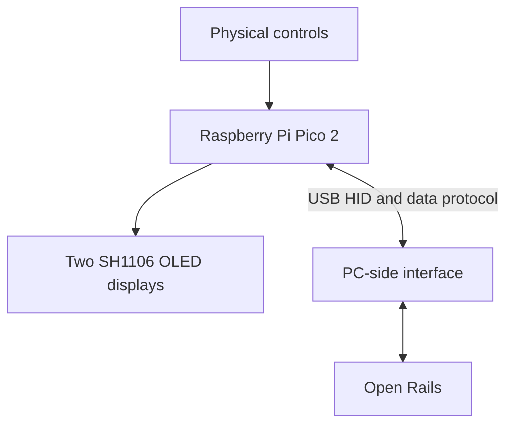

# Train Controller for Open Rails

A physical train controller built for use with
[Open Rails](https://www.openrails.org/), based on a Raspberry Pi Pico 2 and
custom C++ firmware.

The project aims to replace keyboard-only operation with physical traction and
brake controls, switches, push buttons, and two OLED displays. It also serves as
a practical embedded-systems learning project: the core hardware drivers are
being developed at register level without the Arduino framework or Arduino
display libraries.

> **Project status:** Early development. The Pico 2 development environment,
> firmware build, USB flashing, and first register-level GPIO test are working.
> Open Rails integration and the final hardware layout are still under research
> and development.

## Project goals

- Build a functional physical controller for Open Rails.
- Develop the firmware in C++ for the Arm Cortex-M33 cores of the RP2350.
- Learn register-level embedded development on real hardware.
- Implement project-owned GPIO, ADC, I2C, SH1106, graphics, and input layers.
- Operate two SH1106 OLED displays simultaneously.
- Send physical control states to the PC through USB.
- Receive simulator telemetry for display on the controller where supported.
- Produce documented, maintainable hardware and software suitable for a portfolio project.

## Current progress

- [x] GitHub repository created.
- [x] Visual Studio Code development environment configured.
- [x] Raspberry Pi Pico SDK 2.3.0 installed.
- [x] ARM GCC, CMake, and Ninja toolchain verified.
- [x] C++ firmware project created for Raspberry Pi Pico 2.
- [x] Firmware compiled successfully for the RP2350 Arm target.
- [x] Firmware uploaded to the Pico 2 through USB.
- [x] Onboard LED controlled through RP2350 hardware registers.
- [x] RP2350 GPIO pad isolation handled during initialization.
- [ ] Reusable register-level GPIO driver.
- [ ] Register-level ADC and I2C drivers.
- [ ] Custom SH1106 display driver.
- [ ] Physical input prototype.
- [ ] USB controller interface.
- [ ] Open Rails integration.

See the complete [development roadmap](ROADMAP.md) for planned milestones and
task-level progress.

## Planned physical controls

### Analog controls

| Function | Physical control | MCU interface |
| --- | --- | --- |
| Traction controller | Slide potentiometer | ADC |
| Locomotive brake | Slide potentiometer | ADC |
| Rapid brake control | Slide potentiometer | ADC |

### Buttons and switches

| Function | Physical control |
| --- | --- |
| Vigilance control | Momentary push button |
| Windshield wiper | Two-position switch |
| Headlights | Three-position switch |
| Sander | Momentary push button |
| Horn | Momentary push button |
| Reverser | Three-position switch |
| Cab interior light | Two-position switch |
| Pantograph 1 | Two-position switch |
| Pantograph 2 | Two-position switch |
| Emergency brake | Push button |
| Auxiliary controls | Five configurable push buttons |

The initial hardware estimate requires three ADC inputs and seventeen digital
inputs. Two separate hardware I2C controllers are planned for the displays,
allowing both SH1106 modules to use the same I2C address if necessary.

## Planned display information

The controller will use two monochrome 128×64 SH1106 OLED displays. The final
screen layout is not yet fixed, but the planned information includes:

- traction controller value;
- current speed;
- EVM status or indication, if available from the simulator integration;
- brake values or states;
- USB and simulator connection status;
- calibration and diagnostic information.

## System overview



The Pico 2 reads the physical controls, processes their states, updates the
displays, and communicates with the PC. Standard USB HID may be used for input
where practical. A small PC-side bridge may be required for bidirectional
telemetry such as speed and EVM information.

## Development approach

This project does not use the Arduino framework. The firmware uses the official
Raspberry Pi Pico SDK for the startup code, build infrastructure, register
definitions, and selected platform services.

The project will implement the following layers directly:

- GPIO configuration and digital input handling;
- button and switch debouncing;
- ADC sampling, filtering, and calibration;
- I2C master communication;
- SH1106 initialization and display updates;
- framebuffer and drawing primitives;
- bitmap font and text rendering;
- controller state model;
- application-level USB messages.

A supported USB stack will be used rather than implementing the complete USB
protocol stack from scratch. Device descriptors, control mappings, and the
application protocol will still be designed as part of the project.

## Technology stack

- **Microcontroller:** Raspberry Pi Pico 2
- **MCU:** RP2350
- **CPU architecture:** Arm Cortex-M33
- **Language:** C++17
- **SDK:** Raspberry Pi Pico SDK 2.3.0
- **Build system:** CMake and Ninja
- **Compiler:** Arm GNU Toolchain
- **Editor:** Visual Studio Code
- **Version control:** Git and GitHub
- **Displays:** Two SH1106 128×64 monochrome OLED modules
- **PC connection:** USB device mode

## Repository structure

```text
train-controller-for-OpenRails/
├── README.md          Project overview
├── ROADMAP.md         Development milestones
├── firmware/          Raspberry Pi Pico 2 firmware
├── desktop/           Planned PC-side integration
├── hardware/          Planned schematics and pin assignments
└── docs/              Planned technical documentation
```

Only the directories required by the current development stage may exist in the
repository. Additional directories will be added when their first files are
created.

## Building the firmware

### Requirements

- Visual Studio Code
- Official Raspberry Pi Pico extension
- Raspberry Pi Pico SDK 2.3.0
- Raspberry Pi Pico 2
- Data-capable USB cable

The official Pico extension manages the SDK, Arm toolchain, CMake, Ninja, and
project configuration on Windows.

### Build

1. Clone the repository.
2. Open the `firmware` directory in Visual Studio Code.
3. Use **Raspberry Pi Pico: Compile Project**.
4. Find the generated firmware in `firmware/build/`.

The most relevant build outputs are:

- `firmware.elf` — executable and debugging information;
- `firmware.uf2` — firmware image for USB flashing.

### Flash over USB

1. Disconnect the Pico 2.
2. Hold the **BOOTSEL** button while reconnecting USB.
3. Release BOOTSEL after the `RPI-RP2` drive appears.
4. Use **Raspberry Pi Pico: Run Project (USB)** in Visual Studio Code.

Alternatively, copy `firmware.uf2` to the `RPI-RP2` drive manually.

## Planned documentation

As the project develops, the repository will include:

- complete GPIO pin assignment;
- electrical schematic;
- bill of materials;
- control calibration procedure;
- custom I2C and SH1106 driver documentation;
- USB protocol specification;
- Open Rails setup and control mapping;
- enclosure and front-panel design.

## Disclaimer

This is an independent educational and hobby project. It is not affiliated with
or endorsed by the Open Rails project or its contributors.
